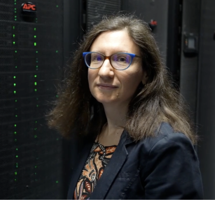
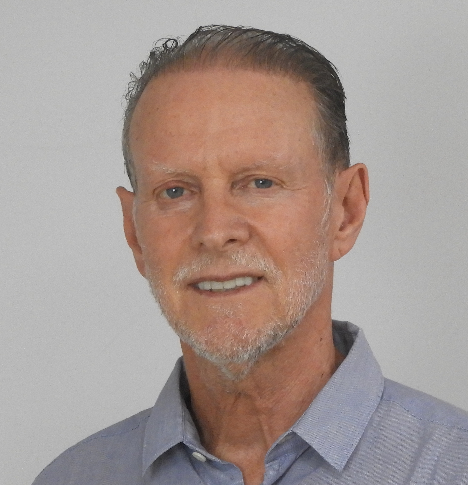
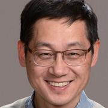

# Keynotes

## Keynote 1: Angela Bonifati ([bio](https://perso.liris.cnrs.fr/angela.bonifati/index.shtml))

**TITLE:** Managing Constraints and Transformations in Property Graphs.

**ABSTRACT:** Property graphs are widely known as an expressive data model for representing interconnected multi-labeled data enhanced with properties as key/value pairs. They are used in a wide range of domains, such as social and transportation networks, biological networks, finance, cybersecurity, logistics and planning, to name a few. Property graphs are the building blocks of future graph ecosystems, in which OLTP and OLAP processes are intertwined with complex advanced processes, such as learning, scientific computing and business intelligence. 
While property graphs are currently used in a variety of graph databases, a rather fragmented landscape emerges in terms of the supported query and schema languages. In particular, the coverage of schema and constraints is limited if not completely lacking in these systems. In this talk, I will present recent advances in terms of schemas and constraints for property graphs, as part of our work within the LDBC community groups. I will also focus on property graph transformations leveraging graph pattern calculus abstractions and leading to a declarative framework having practical utility and efficiency. 
Finally, I will pinpoint future directions of research in this new exciting area of data management. 

**BIO:** Angela Bonifati is a Distinguished Professor of Computer Science at Lyon 1 University and at the CNRS Liris
research lab, where she leads the Database Group. She is also an Adjunct Professor at the University of
Waterloo in Canada from 2020 and a Senior member of the French University Institute (IUF) from 2023. 
Her current research interests are on several aspects of data management, including graph databases, knowledge graphs and data integration with additional interests in data science and machine learning. She has co-authored more than 200 publications in top venues of the data management field, including five Best Paper Awards, two books and an invited paper in ACM Sigmod Record 2018.  She is the recipient of the prestigious IEEE TCDE Impact Award 2023 and a co-recipient of an ACM Research Highlights Award 2023. 
She was the Program Chair of ACM Sigmod 2022 and she is currently an Associate Editor for the Proceedings of VLDB and for several other journals, including the VLDB Journal, IEEE TKDE and ACM TODS. She is the President of the EDBT Executive Board (2020-2025), a member of the PVLDB Board of Trustees (2024-2029) and a member of the IEEE TCDE executive committee (2024-2029).

## Keynote 2: Pierre Hellier ([bio](https://people.irisa.fr/Pierre.Hellier/))

**TITLE:** Learned image and video compression

**ABSTRACT:** Image and video compression continues to be a relevant scientific and technological concern with the continuous growth of video streaming.Recent statistics indicate that streaming accounts for more than 75% of the internet traffic. 
In this talk, I will first briefly recall the principles of classical compression methods, their current limits and the standardization landscape. Then, I will discuss how machine learning brings new methods and capabilities for compression. In particular, ML offers possibilities for semantic compression, as well as new paradigms based on implicit representations.

**BIO:** After an engineering diploma in aeronautics (Ensae-SupAero) and a MsC in applied mathematics obtained at Toulouse university, Dr. Hellier received his PhD on medical image registration in 2000. He moved as a postdoctoral researcher to Utrecht university. He was appointed INRIA researcher in 2001. From 2001 to 2011, He focused on computer vision methods for medical image registration, image-guided neurosurgery and transcranial magnetic stimulation. He was a visiting professor at McGill university, Montreal in 2006. In 2009, Dr. Hellier co-founded a startup to industrialize a neuronavigation system for transcranial magnetic stimulation, and served as scientific council. So far, the neuronavigation system has been used in 30+ hospitals on 10k+ patients.
In 2011, he moved to Technicolor research, working on UGC content synchronization, enhancement, and professional post-production: film grain, color grading, color restoration, unsharp masking and mosaicing. He pursued at InterDigital research in 2019, focusing on machine learning for image and video compression, as well as deep learning for digital human modeling.
Since 2024, He is with the university of Rennes, junior professor chair.

## Keynote 3: John Wu ([bio](https://profiles.lbl.gov/20161-john-wu/))

**TITLE:** Bridging the Data Divide: Distributed Workflow Management for the Next Generation of Scientific Research.

**ABSTRACT:** Modern scientific experiments and simulations generate data at an
unprecedented scale, demanding powerful, yet often geographically distant,
high-performance computing (HPC) resources for analysis.  This fundamental
challenge necessitates innovative data management and workflow systems that
can seamlessly bridge the gap between distributed instruments and computing
power.  This presentation explores the pressing need for integrated
data-centric ecosystems in science.  We examine key application drivers and
survey cutting-edge scientific data management and workflow systems,
highlighting practical examples and emerging technologies.  By connecting
experimental facilities with HPC through efficient data services, we can
unlock the full potential of scientific data, accelerating the pace of
discovery and ushering in a new era of data-driven science.

**BIO:** Dr. Kesheng (John) Wu is a visionary leader in advanced technology research
and development at Scientific Networking Division of Lawrence Berkeley
National Laboratory, leading a team at the forefront of scientific data
management and workflow management.  His work focuses on accelerating
research breakthroughs by seamlessly integrating distributed scientific
facilities with high-performance computing resources.  Dr. Wu's team
develops innovative solutions for data-intensive scientific workflows,
including in-network storage and computation, optimized network operations,
and cutting-edge testbeds involving both conventional optical networking and
quantum communication capabilities.  These testbeds provide a crucial
platform for the broader research community to explore and shape the future
of networking technology.

## Keynote 4: Patrick Valduriez ([bio](https://www-sop.inria.fr/members/Patrick.Valduriez/))

**TITLE:** Data Science and Innovation.

**ABSTRACT:** Data science and innovation have become overloaded terms, leading to some confusion. To be successful, the innovation process involves not only inventions (e.g., new methods) but also context, e.g., user behavior, and timing, e.g., market readiness. In this talk, I discuss the impact of data science on innovation, using selected success stories (some of which I was involved in). I also give hints to promote innovation within companies, in particular, using open innovation. Finally, I describe some innovations in the context of the Inria-Brasil partnership.

**BIO:** Patrick Valduriez is an emeritus director of research at Inria, France, the scientific director of the Inria-Brasil international lab. and the Chief Scientist Officer of the LeanXcale company. He is also a collaborator in the Data Extreme Lab. (DEXL) at LNCC, Rio de Janeiro, Brazil.
He spent most of his career at Inria as director of research, where he created and directed three teams (Rodin, Atlas and Zenith). He has also been a professor of computer science at University Pierre et Marie Curie (UPMC), now Sorbonne University, in Paris (2000-2002), a researcher at Microelectronics and Computer Technology Corp. in Austin, Texas (1985-1989) and a researcher at Inria (1982-1984).

He received his Ph.D. degree (advised by Professor Georges Gardarin) and Doctorat d'Etat in Computer Science from UPMC in 1981 and 1985, respectively. From 1995 to 2000, he was the manager of the Bull-Inria joint venture (called Dyade), which fostered technology transfer in IT and security. Dyade spined off five successful start-ups, including Kelkoo based on the Disco software that he built at Inria with his team. He has also been consulting for major companies in USA (HP Labs, Lucent Bell Labs, Microsoft), Europe (Ask, ESA, Eurocontrol, Shell) and France (Bull, Capgemini, Matra Marconi Space, Murex, Orsys, Schlumberger). 

He is currently a member of the Zenith team (between Inria and University of Montpellier at the LIRMM lab.), focusing on data science, in particular data management in large-scale distributed and parallel systems and scientific data management. He has authored and co-authored more than 400 technical papers and several textbooks, among which “Principles of Distributed Database Systems” (with Professor Tamer Özsu, University of Waterloo). He currently serves as associate editor of the Distributed and Parallel Databases journal. He has served as PC chair of major conferences such as SIGMOD and VLDB. He was the general chair of SIGMOD 2004, EDBT 2008 and VLDB 2009.

He received the best paper award at several international conferences (VLDB 2000, SBAC 2005, VecPar 2008, SBBD 2017, DEXA 2020). He was the recipient of the 1993 IBM scientific prize in Computer Science in France and the 2014 Innovation Award from Inria and the 
