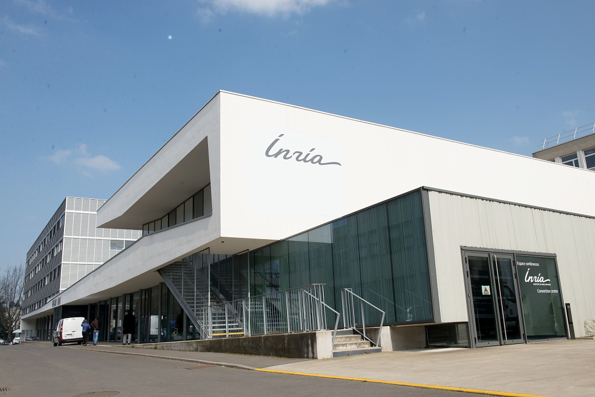
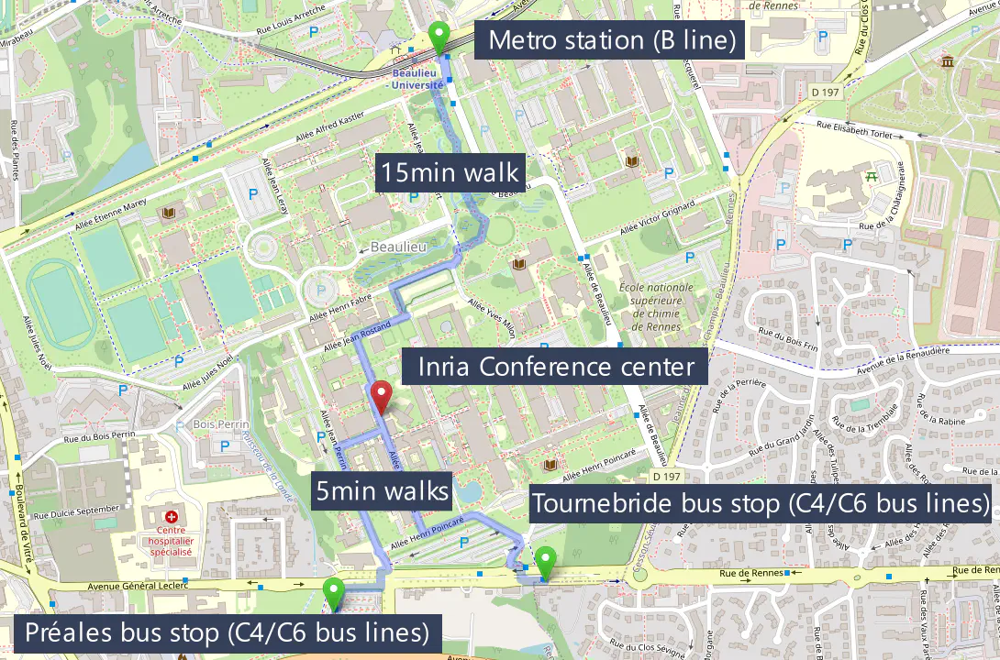
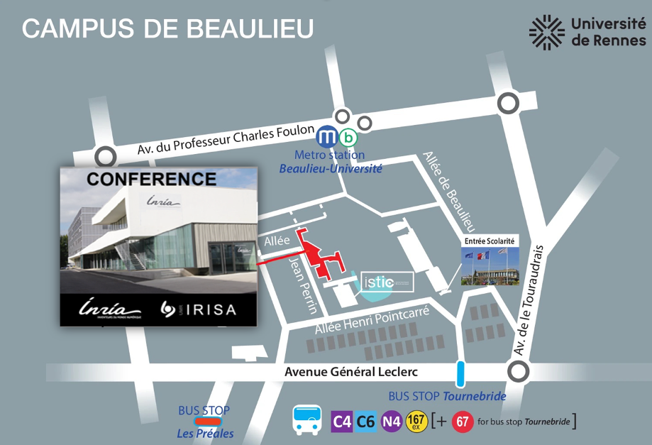

# Conference Venue

The conference will take place in the Inria Convention Center (in the Beaulieu Campus Area) at 263 Av. Général Leclerc, 35042, Rennes, 35000 ([Directions](https://maps.app.goo.gl/419kpUXiYFoLYZTK7)). 

<iframe src="https://www.google.com/maps/embed?pb=!1m23!1m12!1m3!1d2663.6881369569387!2d-1.6420224880158425!3d48.116251452525546!2m3!1f0!2f0!3f0!3m2!1i1024!2i768!4f13.1!4m8!3e6!4m0!4m5!1s0x480edee5a599f107%3A0x318da7854b094389!2sInria%20de%20l&#39;Universit%C3%A9%20de%20Rennes%2C%20Avenue%20G%C3%A9n%C3%A9ral%20Leclerc%2C%20Rennes!3m2!1d48.116203899999995!2d-1.6396323!5e0!3m2!1sen!2sfr!4v1710880307526!5m2!1sen!2sfr" width="600" height="450" style="border:0;" allowfullscreen="" loading="lazy" referrerpolicy="no-referrer-when-downgrade"></iframe>

You can reach the Inria Convention Center with the metro line B (Beaulieu Unviersité station +15 mins walk to reach the convention center) or with city bus lines C4 or C6 (Preales or Tournebride stops, +5 mins walk). Follow this [link](https://www.inria.fr/en/how-reach-inria-centre-rennes-university) for more information on how to reach the Inria centre at Rennes University. 

